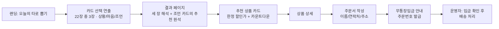

# PRD — 타로 X 108염주 · 합장주 스토어 (프로젝트명: taro108)

문서 버전: v1.0 (2026-07-24)
상태: 초안 → 개발 착수용 확정본
개발 주체: 별도 LLM/개발자 (본 문서 + TRD.md 기준으로 구현)

---

## 1. 개요

타로 카드를 뽑으면, 그 카드의 기운에 맞는 **108염주 팔찌 또는 합장주**를 추천하고
**한정 시간 할인**으로 구매까지 연결하는 커머스 사이트.

- 핵심 컨셉: "재미(타로) → 의미 부여(원석/염주 매칭) → 구매 동기(한정 세일)"
- 운영 방침: 1인 라이트 운영, **월 고정비 0원** (무료 티어만 사용)
- 결제: v1은 **무통장입금** (PG 계약/수수료 없음, 사업자·통신판매업 신고는 별도 준비)

## 2. 목표와 성공 지표

### 목표
1. 타로라는 후킹 요소로 광고 없이도 체류·공유가 일어나는 유입 구조를 만든다.
2. 방문 → 타로 → 추천 → 주문까지 한 화면 흐름 안에서 끝낸다.
3. 운영 부담 최소화: 상품/주문 관리는 Supabase 대시보드로 직접 처리.

### KPI (런칭 후 1개월 기준)
| 지표 | 목표 |
|---|---|
| 타로 뽑기 완료율 (방문자 대비) | ≥ 40% |
| 타로 결과 → 상품 상세 클릭률 | ≥ 25% |
| 주문 전환율 (타로 완료자 대비) | ≥ 2% |
| 결과 공유(링크 복사/SNS) 횟수 | 측정만 (기준선 수집) |

## 3. 타겟 사용자

- **주 타겟**: 2040 여성, 운세/타로 콘텐츠 소비층, 원석·팔찌 액세서리에 관심
- **부 타겟**: 불교 신자·명상 수행자 (합장주/108염주 실사용 목적 구매)
- 특징: 모바일 유입이 대부분 (인스타그램/카카오톡 공유 경유) → **모바일 퍼스트 필수**

## 4. 핵심 사용자 흐름 (P0)

- 타로를 건너뛰고 바로 상품 목록으로 가는 진입점도 상단 내비게이션에 제공.
- 결과 페이지는 고유 URL을 가져 공유 시 동일 결과가 보이게 한다 (예: `/result/major-17`).

## 5. 기능 요구사항

우선순위: **P0 = 런칭 필수 / P1 = 런칭 후 2~4주 / P2 = 반응 보고 결정**

### F1. 타로 뽑기 (P0)
- 메이저 아르카나 **22장, 3장 뽑기** 방식 (78장 풀덱은 P2).
- 자리는 **지금의 상황 · 당신의 마음 · 오늘의 조언** 순. **마지막 '조언' 자리 카드가 추천 원석을
  정한다** — 세 장을 읽어도 팔리는 상품은 하나로 모아 특가 카운트다운의 집중도를 지킨다.
- 부채꼴로 펼친 뒷면 배열에서 3번 탭하여 선택 (랜덤은 클라이언트에서 결정).
- 카드 선택 시 뒤집힘 연출(정방향만 사용, 역방향 해석은 v1 제외).
- 하루 제한 없음 (여러 번 뽑기 허용 — 재방문 유도가 이득).

### F2. 결과 페이지 (P0)
- 구성: 카드 이미지 + 카드명(한/영) + 오늘의 메시지(2~3문장) + 키워드 3개.
- 이어서 "이 카드의 기운을 담은 원석" 섹션: 카드 ↔ 원석 매핑 근거 1문장 + 추천 상품 1~3개.
- **한정 세일 블록**: 추천 상품에 할인가 표시 + "타로 특가 24:00:00" 카운트다운.
  - 할인 정책: 타로 결과 경유 시 정가 대비 **10~15% 할인** (상품별 `sale_price`로 관리).
  - 카운트다운은 뽑은 시점 기준 24시간, 클라이언트 저장(localStorage). 만료 후엔 정가 노출.
  - 엄격한 어뷰징 방지는 하지 않는다 (라이트 운영 정책 — TRD §7 참고).
- 공유: URL 복사 버튼 + 카카오톡 공유(P1, 없으면 URL 복사로 대체).

### F3. 상품 카탈로그 (P0)
- 카테고리 2개: **108염주 팔찌 / 합장주**. 초기 SKU 6~12개 상정.
- 목록: 썸네일, 상품명, 원석명, 정가/할인가, 품절 표시.
- 상세: 이미지 여러 장, 원석 의미 설명, 사이즈/소재, 배송 안내, 관련 타로 카드 뱃지.
- 재고: 수량 단위 관리 (`stock`), 0이면 품절 표시 + 주문 버튼 비활성.

### F4. 주문 — 무통장입금 (P0)
- 비회원 주문만 지원 (회원가입 없음).
- 주문서 입력: 주문자명, 연락처, 배송지 주소, 요청 메모(선택), 수량.
- 제출 시: 주문번호 생성 → DB 저장 → 입금 계좌/금액/기한(48시간) 안내 화면.
- 주문 직후 안내 문구: "입금자명이 다르면 카카오톡 채널로 알려주세요."
- 배송비 정책: 기본 3,500원, 50,000원 이상 무료 (값은 상수로, 쉽게 수정 가능하게).
- 주문 상태: `입금대기 → 입금확인 → 배송중 → 완료 / 취소` (상태 변경은 운영자가 Supabase 대시보드에서 직접).

### F5. 주문 조회 (P1)
- 주문번호 + 연락처 뒤 4자리로 상태 조회하는 단일 페이지.
- v1 런칭 시엔 생략 가능 — 카카오톡 채널 문의로 대체.

### F6. 운영/관리 (P0 — 단, 별도 개발 없음)
- **관리자 페이지를 만들지 않는다.** 상품 등록/수정, 주문 상태 변경, 재고 관리는
  Supabase Studio(Table Editor)에서 직접 수행. 운영 절차는 TRD §11 런북 참조.
- 신규 주문 인지: 운영자가 대시보드 확인 (P1: 이메일/텔레그램 알림 자동화).

### F7. 정적 콘텐츠 (P0)
- 필수 고지 페이지: 이용약관, 개인정보처리방침, 사업자 정보(상호/대표/사업자번호/통신판매업 신고번호), 배송·교환·환불 정책.
- 브랜드 소개 1페이지 (원석·염주 제작 스토리).

### F8. 유입/공유 최적화 (P1)
- 타로 결과별 OG 이미지 (카드 이미지 + 문구) → 카카오톡/인스타 공유 시 미리보기.
- 기본 SEO: 타이틀/디스크립션, sitemap, robots.

## 6. 비기능 요구사항

- **모바일 퍼스트**: 360px 기준 설계, 데스크톱은 가운데 정렬 확장.
- 성능: 첫 로딩 3초 이내(4G), 타로 연출은 CSS 트랜지션 수준 (무거운 애니메이션 라이브러리 금지).
- 접근성 기본: 대체 텍스트, 폼 라벨, 명도 대비.
- 언어: 한국어 단일.
- 분석: Vercel Analytics 무료 티어 또는 self-host 불필요한 경량 도구 1개만.

## 7. 범위 제외 (v1에서 하지 않는 것)

| 제외 항목 | 사유 / 재검토 시점 |
|---|---|
| 회원가입/로그인 | 비회원 주문으로 충분. 재구매율 확인 후 |
| PG 결제 (카드/간편결제) | 수수료·계약 부담. 월 주문 30건 넘으면 토스페이먼츠 도입 |
| 관리자 웹 UI | Supabase Studio로 대체. 운영자가 2인 이상 되면 |
| LLM 기반 타로 해석 | 고정 해석 텍스트로 충분. 비용 발생 요소 |
| 리뷰/별점 | 초기엔 인스타 후기 링크로 대체 |
| 78장 풀덱·역방향 | 22장 반응 확인 후 (3카드 스프레드는 F1으로 반영 완료) |
| 다국어 | 해당 없음 |

## 8. 오픈 이슈 (개발 전 확정 필요)

1. **입금 계좌 정보** — 주문 안내 화면에 넣을 은행/계좌/예금주.
2. **초기 상품 목록** — SKU별 상품명, 원석, 정가, 할인가, 재고, 사진.
3. **22장 카드별 해석 문구와 원석 매핑** — TRD §10에 초안 매핑표 포함, 감수 필요.
4. **사업자/통신판매업 신고번호** — 고지 페이지에 필요. 판매 개시 전 법적 필수.
5. 도메인 구입 여부 (유일한 유료 항목, 연 1.5~2만원. 미구입 시 `*.vercel.app`).
